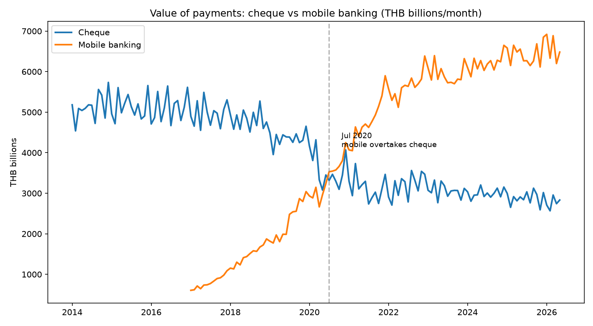
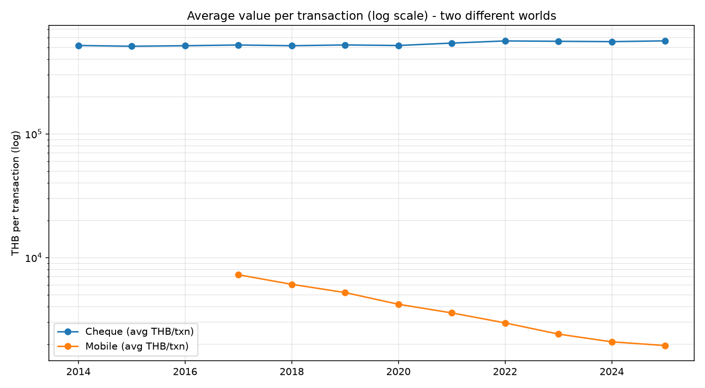

# เช็ค vs Mobile Banking — 12 ปีที่เงินไทยย้ายบ้าน

วิเคราะห์การเปลี่ยนผ่านช่องทางชำระเงินของไทย จากข้อมูลเปิดของธนาคารแห่งประเทศไทย (BOT API)
ช่วงเดือน ม.ค. 2014 – พ.ค. 2026 (รายเดือน, 149 งวด)

## คำถาม

"เช็คกำลังตายจริงไหม ตายเร็วแค่ไหน แล้วเงินย้ายไปไหน"

## ข้อค้นพบ



**1. คนไทยเขียนเช็คน้อยลงครึ่งหนึ่งใน 12 ปี** — จาก 118.8 ล้านฉบับ (2014) เหลือ 61.3 ล้านฉบับ (2025)
โควิดอัดการเปลี่ยนผ่านระดับทศวรรษให้เกิดในสองปี (ดิ่งปีละ ~17% ช่วง 2020–21)
หลังจากนั้นชะลอเหลือปีละ 1–5% — ช้าลง แต่ไม่เคยหยุด

**2. ก.ค. 2020 กลางล็อกดาวน์ คือเดือนที่มูลค่าธุรกรรม mobile banking แซงเช็คเป็นครั้งแรก**
(3,531 vs 3,317 พันล้านบาท/เดือน) และไม่เคยแพ้อีกเลย — ปัจจุบันทิ้งห่างกว่าเท่าตัว

**3. สองช่องทางนี้ไม่ได้แข่งกัน — มันแยกโลกกันไปแล้ว**
เช็คเฉลี่ยฉบับละเกือบ 600,000 บาท และ*ใหญ่ขึ้น*ทุกปี (รายย่อยหนีหมด เหลือแต่ธุรกรรมธุรกิจ)
ส่วน mobile ตกจาก 7,263 → 1,885 บาท/รายการ และยังลดต่อ
= mobile banking เปลี่ยนสถานะจากเครื่องมือโอนเงิน เป็นกระเป๋าสตางค์หลักของประเทศ



## ข้อมูลและวิธีทำ

แหล่งข้อมูล: [BOT API](https://portal.api.bot.or.th/) — Statistics product, series รายเดือน 4 ตัว

| series | ความหมาย |
|---|---|
| PSPTFCTHM00061 / 00082 | ปริมาณ / มูลค่า การชำระเงินด้วยเช็ค |
| PSPTFCTHM00222 / 00223 | ปริมาณ / มูลค่า ธุรกรรมผ่าน mobile banking |

Pipeline: `ingest.py` (ดึง API + เก็บ raw ทุก response เป็น audit trail) →
`clean.py` (ตรวจจับ schema อัตโนมัติ, ทำความสะอาด, โหลดเข้า DuckDB) →
`analysis.sql` (คำถามละ query) → `charts.py`

สิ่งที่เจอระหว่างทาง (ของจริงที่สเปกไม่ได้บอก):

- **API คืนไม่เกิน 120 observations ต่อ request** — series ที่ยาวกว่า 10 ปีต้องแบ่งช่วงดึงแล้ว dedupe
- **หน่วยแต่ละ series คนละโลก** (พันล้านบาท vs พันรายการ) — ค่าเฉลี่ยต่อรายการต้องแปลงหน่วยก่อน
  ไม่งั้นฝั่ง mobile ถูกปัดเศษหายทั้งช่องทาง
- **ปีล่าสุดเป็นปีไม่เต็ม** — YoY ของปีนั้นติดลบปลอมกว่า 50% ถ้าอ่านตรงๆ
  (ดักไว้ด้วยคอลัมน์ `months_in_year` และตัดทิ้งจากกราฟ)

## วิธีรัน

```bash
python -m venv .venv && source .venv/bin/activate   # Windows: .venv\Scripts\activate
pip install -r requirements.txt
cp .env.example .env    # ใส่ BOT_API_KEY (สมัครฟรีที่ portal.api.bot.or.th)

python src/ingest.py        # ดึงข้อมูล -> data/raw/
python src/clean.py         # ทำความสะอาด -> data/processed/bank.duckdb
python src/run_analysis.py  # ผลวิเคราะห์ทั้งหมด
python src/charts.py        # กราฟ -> charts/
```

## ข้อจำกัด

- แนวโน้มสวนทางกัน ≠ อันหนึ่งเป็นเหตุของอีกอัน — ข้อมูลชุดนี้บอกได้ว่า*เกิดอะไร* ไม่ได้พิสูจน์ว่า*เพราะอะไร*
- นิยามแต่ละ series เป็นของ ธปท. — mobile banking ในที่นี้ไม่รวม e-Money และช่องทางอิเล็กทรอนิกส์อื่น
  ภาพ "ดิจิทัลทั้งหมด" จริงจึงใหญ่กว่าที่เห็นในเคสนี้อีก

## เกี่ยวกับเคสนี้

ส่วนหนึ่งของ portfolio งานวิเคราะห์ข้อมูล — ถ้าธุรกิจของคุณมีข้อมูลอยู่ในมือ
แต่ยังไม่เคยตอบคำถามแบบนี้ได้ คุยกันได้ครับ